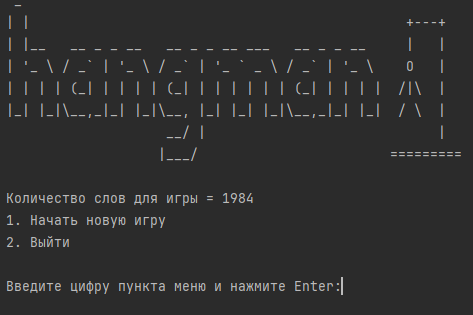
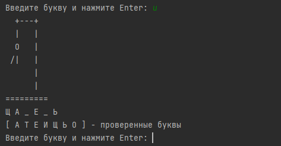

<h1 style="text-align: center;">Hangman (Виселица)</h1>



### Описание
Простейшая всем известная игра. Без графической оболочки. Консольная версия. Писалась в целях самообучения. \
В игре необходимо разгадать слово до того как полностью отрисуется висельник. Пользователь изначально видит вместо букв 
загаданного слова символы подчеркивания. После введения буквы пользователем, если буква есть в слове то она открывается 
в слове. Или, если введенной буквы в слове нет, то отрисовывается следующая часть висельника.



При создании никаких дополнительных зависимостей не использовалось. В процессе написания были закреплены основы языка 
Java, валидация данных, работа с файловой системой, чтение из файла.

### Запуск игры
Запуск из IDE через метод main() в классе Main.

Для запуска без IDE через консоль необходимо перейти в папку **src/main/java** и сначала скомпилировать файлы, выполнив 
команду: 
```
javac -d ../resources ru/vladshi/javalearning/Main.java
```

И затем что бы запустить игру перейти в папку **/resources** и выполнить команду:
```
java ru.vladshi.javalearning.Main
```

Вместо папки **/resources** вы при компиляции можете указать другое название (например, bin или classes). Но тогда 
вам будет необходимо перенести в эту папку файл с базой слов **slova.txt**, на один уровень с папкой **/ru**.

Новые слова можно добавлять в файл **slova.txt**. Слово должно быть написано большими буквами русского алфавита на 
отдельной строке.